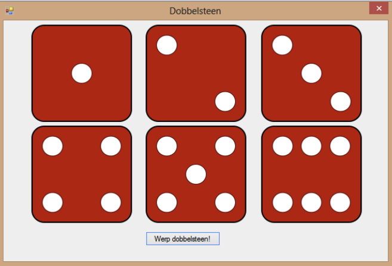

# Training - Dobbelsteen

Als je een game wilt programmeren dan stuit je zelfs bij de meest eenvoudige games (boter-kaas-en-eieren) op het probleem: hoe programmeer ik willekeur? Doe een willekeurige zet? Hoe programmeer je dat?

Om dit te ervaren ga je een klein programma schrijven waarmee je het willekeurige gedrag van een dobbelsteen simuleert. Als dit zogenaamde “proof-of-concept”-programma werkt weet je beter hoe je tijdens het ontwerpen rekening met de benodigde willekeur kunt houden en heb je meer zekerheid over de kans van slagen van de game.

## Opdracht
Maak een user interface met 6 picturebox-en en een button die er zo uit ziet:

Er staan zes objecten van het type **PictureBox** een “Werp dobbelsteen!”-Button op het formulier. De **PictureBox**-objecten zijn allemaal onzichtbaar als het programma wordt uitgevoerd (de **Visible Property** staat op **false**).

Het is de bedoeling dat telkens als op de “Werp dobbelsteen!”-**Button** geklikt wordt, precies één willekeurige PictureBoxzichtbaar wordt. De andere pictureboxen worden dus onzichtbaar. Programmeer deze functionaliteit.

## Uitbreidingen
-       Niveau * - Plaats alle **PictureBox**-objecten precies over elkaar heen (zo lijkt het alsof telkens dezelfde dobbelsteen opnieuw wordt gegooid).
-       Niveau ** - Maak gebruik van één switch statement (tip: Zoek op internet naar een bron) in plaats van verschillende “if … else … ” statements.

## Checklist
Als je de opdracht op de juiste manier hebt uitgevoerd heb je voldaan aan onderstaande punten:
- Bij het starten van het programma zijn geen dobbelsteenafbeeldingen zichtbaar.
- Bij een druk op de knop wordt precies één afbeelding van een dobbelsteen zichtbaar.
- Bij de volgende druk op de knop wordt weer precies één afbeelding (dit kan toevallig dezelfde zijn) van een dobbelsteen zichtbaar.
- Als je tientallen keren na elkaar op de knop klikt zie je de afbeeldingen voor dobbelsteen 1, 2, 3, 4, 5 en 6 in ieder geval één keer getoond worden.
- Als je tientallen keren na elkaar op de knop klikt worden nooit twee afbeeldingen tegelijkertijd getoond.
- Je hebt niet meer “if … else …” constructies gebruikt dan nodig.
- Je hebt in iedere “if … else …” constructie in het “if” blok regels code staan.
- Je hebt in iedere “if … else …” constructie in het “else” blok regels code staan of je hebt het “else” blok weggelaten.
- Uitbreiding a: Ongeacht welke waarde wordt gegooid, de afbeelding met het aantal ogen wordt altijd op dezelfde plek getoond.
- Uitbreiding b: Naast het “switch” statement heb je geen “if…else…” statements meer gebruikt en je hebt geen “default” case binnen het switch statement gebruikt.

## Bronnen
- [Keuzestructuren](https://stasemsoft.github.io/softwarematerial/docs/basic/conditioneel/naslag_Keuzestructuren.html)
- [Random class Microsoft Docs](https://docs.microsoft.com/en-us/dotnet/api/system.random?view=net-5.0)
