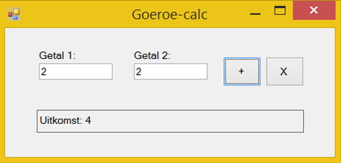

# Training Goeroe-calc: variabelen, bewerkingen en conversies

(Concepten: int, double, bewerkingen en conversies)

## Voorbereiding

Ken je het verschil tussen een int, double en string?

## Inleiding

We gaan een werkende calculator maken. Het is een minimalistische calculator, maar hij kan zaken voor je uitrekenen die je zelf niet kunt. Hoeveel is 655 maal 23623? De mens gebruikt daar liever een programma voor. Jij kunt dat programma maken.

## Opdracht

Maak de user interface van de calculator waarbij je minimaal twee Textboxen, een Label en twee Buttons (een voor optellen en een voor vermenigvuldigen) hebt.

De gebruiker kan gehele getallen (integers) invullen in de tekstboxen. Programmeer nu de functionaliteit van de calculator conform de volgende specificatie:

+ Als de gebruiker op de knop Plus klikt dan worden de twee ingevoerde getallen bij elkaar opgeteld en in een label getoond als uitkomst.
+ Als de gebruiker op de knop Vermenigvuldig klikt dan worden de twee ingevoerde getallen met elkaar vermenigvuldigd en in een label getoond als uitkomst.

Is het gelukt? Dan heb je nu zelf een programma geschreven dat meer kan dan jijzelf (binnen een milliseconde de getallen 7225 en 5588 met elkaar vermenigvuldigen bijvoorbeeld) en heb je de eerste stap gezet om een ervaren software engineer te worden.

Zit je vast? Stel een vraag aan je buurman of -vrouw! Als jullie er samen niet uitkomen vraag je het aan je docent. In het begin kan dit programmeren best moeilijk zijn.

Als de calculator werkt dan kun je nog de laatste 2 requirements programmeren. Dat zijn deze:
+ De uitkomst wordt getoond als “Uitkomst: 123” in een label dus met de tekst “Uitkomst: “: voor de daadwerkelijke uitkomst.
 De calculator moet werken met gebroken getallen. Dus 3.14 maal 2.0 moet 6.28 opleveren.

Misschien had je die al, dan ben je niet alleen goed in programmeren, maar heb je de analyse-fase ook eervol doorlopen.

Bespreek deze opdracht met je docent en voer feedback van je docent in in Feedpulse.

## Extra’s

Wil je graag lachende smiley’s in Feedpulse? Verzin dan uitbreidingen op de opdrachten of eigen opdrachten en vraag feedback (let op: je moet deze extra’s zelf kunnen programmeren voor een hogere beoordeling, code-kopie van internet is niet voldoende). Enkele mogelijke uitbreidingen:

+ Breid de calculator uit met een functie voor worteltrekken.
+ Maak de tekst van het label rood (rode letters) als de uitkomst onder de nul is.
+ Breidt de calculator uit met een functie voor delen. Zorg ervoor dat delen door 0 netjes wordt afgevangen en laat een nette foutmelding zien.
