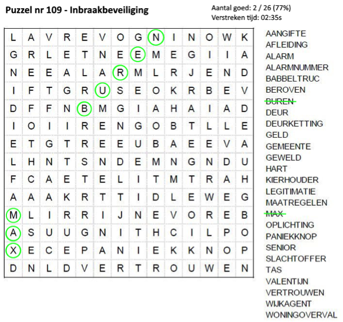

| Versie | 1 - Jan Oonk |
| --- | --- |
| Niveau | 4 of 5. |
| Leerdoelen | Class, Property, Constructor, private/public, UI separation, algoritme, file read/write. |
| Vereiste voorkennis | Method, GUI, Basic Types, If. |
| Challenge Type | Programming, algoritme. |

Op basis van een set woorden (uit een tekstbestand) een woordenzoeker puzzel van een opgegeven breedte x hoogte genereren. Woorden worden verstopt zowel horizontaal (links-rechts al dan niet achtste voren) als verticaal (boven-beneden al dan niet achterste voren). Zorg ervoor dat de woorden binnen het speelveld blijven en niet “wrappen” naar de andere kant van het speelveld.
Daarna moet de speler de woorden kunnen zoeken. Een deel van het spelersscherm bestaat uit overzicht van woorden die gezocht moeten worden en ander deel is het speelveld van letters.
Speler kan woorden aanstrepen in het speelveld door letters te kiezen middels de linkerknop van de muis. Een letter die al geselecteerd is, wordt bij opnieuw aanklikken gedeselecteerd. De gekozen letters worden meteen automatisch gecontroleerd na aanklikken.
Letters kunnen alleen worden geselecteerd in dezelfde richting als de vorige geselecteerde letter(s). Als de geselecteerde letters als woord worden herkend in de lijst van verstopte woorden dan wordt deze doorgestreept.
Tijdens het selecteren van letters, worden oranje omcirkeld. Als de geselecteerde letters een nog te zoeken woord vormen worden de cirkels definitief groen.
Letters kunnen vaker worden geselecteerd en onderdeel zijn van meerdere woorden.
Laat een timer zien hoe lang de speler al aan het spelen is.
Om de letters in de vakjes te plaatsen kan je `DrawText` gebruiken of een *Sprite Generator* (gebruik monospace font als *Consolas,Regular,72*) gebruiken en deze plaatjes dynamisch inladen.
#### Leerdoelen OIS12

<dl><dt>Zeker:</dt>
<dd>Class, constructor, private/public, property, field, method, file handling, GDI graphics, enum, lijsten,</dd>
<dt>Hoogstwaarschijnlijk/goed mogelijk:</dt>
<dd>method/constructor overloading, UML, excepties, static, casting</dd>
<dt>Eventueel:</dt>
<dd>XAML</dd>
</dl>

#### Bronnen

[Sprite Font Generator](https://www.scirra.com/forum/sprite-font-generator-v3_t86546)
[Write Text on a Bitmap](https://stackoverflow.com/questions/6311545/c-sharp-write-text-on-bitmap)
#### Bronnen benodigd bij de extra features

[Sound Engine](https://www.ambiera.com/irrklang/downloads.html)
[Database connectie e.d.](http://csharp-station.com/Tutorial/AdoDotNet)
[Webclient](https://msdn.microsoft.com/en-us/library/system.net.webclient(v=vs.110).aspx)
[How to: Request Data Using the WebRequest Class](https://docs.microsoft.com/en-us/dotnet/framework/network-programming/how-to-request-data-using-the-webrequest-class)
[What difference is there between WebClient and HTTPWebRequest classes in .NET?](https://stackoverflow.com/questions/4988286/what-difference-is-there-between-webclient-and-httpwebrequest-classes-in-net)
[JSON Parser](https://www.newtonsoft.com/json)

#### Variatie / extra features:

<dl><dt>Niveau -</dt>
<dd>Feature</dd>
<dt>* -</dt>
<dd>sla de highscores (is verstreken speeltijd) en de naam van de speler op in een bestand.</dd>
<dt>* -</dt>
<dd>Variatie toevoegen, via een menuoptie, om getallen te zoeken i.p.v. woorden.</dd>
<dt>* -</dt>
<dd>moeilijkheid van de te genereren puzzel is in te stellen via een start menu o.i.d., bijv. door woorden vaker achterste voren in de puzzel te zetten, diagonaal te plaatsen.</dd>
<dt>* -</dt>
<dd>Als alle woorden gevonden zijn dient de speler de overgebleven letters in de juiste volgorde te zetten om zo een woord of correcte zin te vormen.</dd>
<dt>* -</dt>
<dd>categoriseer de woorden in thema’s, zodat verstopte woorden allemaal met elkaar te maken hebben bijv. categorie/thema Planten, Films o.i.d.</dd>
<dt>* -</dt>
<dd>De woorden, die in de te genereren puzzel worden verstopt, uit een database halen i.p.v. een bestand. Maak eerst een eenvoudig database model en ontwerp.</dd>
<dt>* -</dt>
<dd>Voeg leuke soundeffects toe bij bepaalde events zoals correct woord, incorrect woord, letter selecteren, puzzel af e.d.</dd>
<dt>* -</dt>
<dd>Als op escape wordt gedrukt, worden de eventuele geselecteerde letters gedeselecteerd.</dd>
<dt>* -</dt>
<dd>2e letter selectie manier inbouwen: letters kunnen ook worden geselecteerd door de linkerknop in te houden en te slepen. Alle letters worden geselecteerd tussen beginletter en muispositie. Bij loslaten wordt het woord, dat gevormd wordt door de selecteerde letters, gecontroleerd. Is het fout/nog niet goed dan kan in dezelfde richting opnieuw worden geselecteerd (door de normale manier of deze nieuwe manier), de vorige geselecteerde letters blijven dus actief (oranje).</dd>
<dt>* -</dt>
<dd>Als je letters selecteert door deze aan te klikken en je kiest de volgende letter niet in dezelfde richting en/of de letter is niet aangesloten met 1 van de zojuist eerdere geselecteerde letters dan worden al deze geselecteerde letters gedeselecteerd.</dd>
<dt>** -</dt>
<dd>sla de highscores op op een centrale plek (file of database). Maak hiervoor een eenvoudige webservice.</dd>
<dt>** -</dt>
<dd>spelers willen graag hun highscores op een eerlijke manier met elkaar vergelijken, dus zorg ervoor dat de puzzels op exact dezelfde manier aan de verschillende spelers wordt gepresenteerd, dus alle letters in een puzzel en verstopte woorden staan op exact dezelfde plek. Toon de highscores per puzzel. Geef hiervoor elke puzzel een unieke naam of id. Toon dit in een selectiemenu zodat je een bepaalde puzzel kan inladen.</dd>
<dt>*** -</dt>
<dd>Als snel blijkt de highscore webservice (zie ** uitbreiding) te zijn gehacked door script kiddies die de url hebben weten te achterhalen. Verzin een manier om de webservice te beveiligen, zodat er niet onrealistische of onterechte highscores kunnen worden verstuurd naar de webservice.</dd>
</dl>
