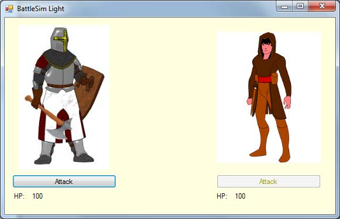

# challenge BattleSim

| Datum | Week 11/12 |
| --- | --- |
| Versie | 1 - Inge van Engeland |
| Leerdoelen | Class, Property, Constructor, private/public, UI separation. |
| Vereiste voorkennis | Method, GUI, Basic Types, If. |
| Challenge Type | Programming |

### Inleiding
In het spel BattleSim kun je met twee spelers tegen elkaar vechten.
In deze versie is de linkerspeler een Knight en de rechterspeler een Ranger.
Beide spelers hebben elk 100 hitpoints.
Het is een turn-based spel, dus om beurten vallen de spelers elkaar aan.
De sterkte van de aanval ligt tussen de 0 (een misser) en de 30.
Als de speler een klap van meer dan 25 geeft, dan heb je een “Critical hit”.
Op het moment dat het aantal hitpoints 0 of minder is,
dan heeft die speler helaas verloren.

### Opdracht
Programmeer de BattleSim. Figuur

is een voorbeeld van hoe het scherm eruit kan zien.

Opdracht BattleSim

- Maak een klasse Speler, deze heeft een naam en een aantal hitpoints.
- Maak de properties en de constructor voor deze klasse.
- De klasse speler heeft een methode om schade te ontvangen en een methode om schade te geven.
- Een aanval geeft 0-30 schade.
- Als de aanval 0 is, is het een misser (geef een bericht dat het een misser was).
- Als de aanval 25+ is, dan is het een “Critical Hit” (geef een bericht).
- Na elke aanval worden de hitpoints bijgewerkt op het scherm.
- Als het aantal hitpoints 0 of minder is, dan heeft die speler verloren.
- De karakters om beurten aanvallen.
- Als de ene speler aan de beurt is, kan de andere speler niet op de “Attack” knop klikken.

### Extra
Verzin functies om je BattleSim uit te breiden. Denk bijvoorbeeld aan:
- Plaatje dat verandert als de speler gewonnen / verloren heeft
- Startscherm waarin je een karakter kunt kiezen en een naam kunt geven
- Een “Explore” knop erbij, waarmee je bijvoorbeeld een health potion kunt vinden.
- Hou de hitpoints bij in een Progress Bar.
- Wapens, armor etc.
