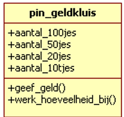

# Voorbeeld OOP: pinautomaat

Als voorbeeld van Object Oriented Programming wordt hier het automatiseren van een PIN-automaat besproken.

## Object

Bij de pinautomaat heb je te maken met een aantal `objecten`, dat zijn de zaken die bepaalde handelingen verrichten.
Je hebt bijvoorbeeld de *PinKlant*. Die zal een *Rekening* hebben bij een bepaalde *Bank*, en een *PinPas*, anders kan hij of zij niet *Pinnen*. Daarom noemen we de *PinKlant* vanaf nu een *RekeningHouder*. Dat is het eerste `object`.

Dan hebben we de *PinAutomaat* zelf, dat is ook een `object`. Verder is er een `object`, waarin het geld zit dat gepind kan worden. Dat noemen we de *PinGeldkluis*. Dat object zal vast heel dicht in de buurt van de pinautomaat zitten, maar we nemen toch maar aan dat het een apart object is.
En natuurlijk zal bij het pinnen de `database` van de *Bank* geraadpleegd moeten worden, dat kun je ook een object noemen.

## Class en instance

Er zijn natuurlijk een heleboel rekeninghouders. De verzamelnaam voor al die rekeninghouders is een `Class`.
Als je een bepaalde rekeninghouder hebt, bijvoorbeeld de heer R.J. van der Beek, dan is dat een `object` of ook wel `instance van een class`.

De `verzamelnaam` voor alle *pin-geldkluisen* is de class *PinGeldKluis*: in `class` *PinGeldKluis* staan de eigenschappen en het gedrag  van alle `objecten` van het `type` *PinGeldKluis* geprogrammeerd.

Als je de pin-geldkluis van de pinautomaat van de *Frieslandbank* in *Buitenpost* als voorbeeld neemt, dan is dat een `object`. Het wordt ook wel een `instance` (`instantie`) van de class pin-geldkluis genoemd. De termen `instance` en `object` worden door elkaar gebruikt.

## Attribute

In die pin-geldkluis van de pinautomaat van de Frieslandbank in Buitenpost zit een bepaalde hoeveelheid bankbiljetten. Er zitten misschien wel 200 *biljetten* van 100 euro in, en misschien ook wel 200 *biljetten* van 50 euro, en een aantal *biljetten* van 20 euro en een aantal *biljetten* van 10 euro.

Die aantallen noem je de `attributes` (~`attributen`) van de class PinGeldkluis. En de pin-geldkluis bevat vast ook wel een *chip* met *geheugenplaatsen*, waarin die aantallen worden vastgelegd.

## Operatie

Die aantallen veranderen natuurlijk voortdurend, en in de geheugenplaatsen moeten die veranderingen ook worden bijgehouden.
Als er 200 euro is gepind (4 keer 50 euro) dan moet het aantal 50jes met 4 worden verminderd. Het *programma-onderdeel* dat daarvoor zorgt noem je een `operation` (~operatie) of `method`. Dus een `class` bevat ook een aantal `methods`.

Er is een `method` die we hier  "*WerkHoeveelheidBij*" noemen. En die 200 euro moet dan in de la van de pinautomaat worden gelegd, de method die daarvoor zorgt noemen we "*GeefGeld*".

Je ziet vaak dat de namen van methods werkwoorden zijn en die van attributes vaak zelfstandige naamwoorden (namen van classes zijn ook zelfstandige naamwoorden).

In welke taal je ook programmeert, vaak wordt het (technisch) ontwerp gemodelleerd volgens ge-unificeerde modelleerafspraken: in *UML*, ofwel *Unified Modeling Language*.
In een `UML class diagram` worden classes door rechthoeken voorgesteld, met bovenin een vak waarin de naam van de class.
De attributes en operations van de class worden weergegeven in twee andere vakken binnen de rechthoek, de attributes in het middelste vak en de operations in het onderste vak.

Van het pinproject zie je een mogelijk `class diagram` hieronder. Daarin zie je dat er ook classes bestaan zonder attributen .

## Object Oriented

In UML worden de dingen, die er gebeuren, meestal omschreven als het `versturen van boodschappen door objecten`, en het uitvoeren van operaties (of methods) door de objecten.
Als de rekeninghouder R.J. vd Beek zijn pinpas in het pinapparaat plaatst, dan wordt die gebeurtenis in UML omschreven als: *het object R.J. vd Beek stuurt de volgende boodschap naar het pinapparaat: controleer mijn pinpas.*

Het pinapparaat voert vervolgens de operation (method) "*LeesPasnummer*" uit.
Daarna stuurt het pinapparaat een seintje naar de erop aangesloten computer om in de database het pasnummer te controleren.
Die gebeurtenis wordt in UML omschreven als: *het object pinapparaat stuurt de volgende boodschap naar het object computer: controleer het pasnummer.*

Het basisidee van `OOP` is dat de wereld bestaat uit `objecten` die met elkaar communiceren door elkaar `boodschappen` (`messages`) te sturen. In talen als C# wordt dat geïmplementeerd door objecten die methoden van elkaar aanroepen.
