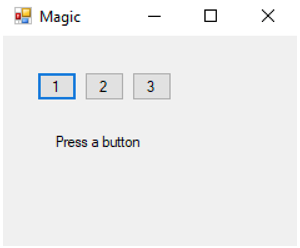

# Cast

## Wat is casting?
Een voorbeeld van casting in C#

```cs
Product product = (Product) ListBoxProducten.Items[2];
```

Uit de `Items` van een `ListBox` genaamd *ListBoxProducten*
wordt hier het item met *index* 2 uitgelezen.
De Items zijn van type *Object* maar de ontwikkelaar wéét dat alle
*items* in de *ListBox* van *type* `Product` zijn,
en wil dit item dus in een variabele van type `Product` stoppen:
dit kan door een `cast` te gebruiken: Het `(Product)` meteen rechts
van het **=**-teken is de `cast` en geeft aan dat wat er rechts van staat
behandeld moet worden als zijnde van het type `Product`.


## Waarom is casten onveilig en moet je het zo weinig mogelijk gebruiken?
Alle zogenaamde statisch getypeerde talen (*statically-typed languages*)
als C#, Java, C en C++ ondersteunen casting.
*Statically typed* wil zoveel zeggen als:
`Compile time` (dus op het moment dat het programma wordt gecompileerd) wordt van elke waarde en variabele vastgesteld wat het type is.
Dat type kan `runtime` (tijdens het uitvoeren van het programma)
niet meer veranderen: de compiler kan hierdoor een hoop fouten opsporen
en de ontwikkelaars waarschuwen. Ontwikkelaars gebruiken dit als een soort vangnet.
Door te gaan `casten` maak je gaten in dat vangnet:
je zegt tegen de compiler: bemoei je er niet mee:
Trust me, I know what I'm doing.  


## Een beter alternatief
In C# kan je in plaats van de compiler buiten spel zetten “Trust me, I know what I’m doing” ook gebruik maken van de kennis van die compiler.

Stel, we hebben het volgende programma gemaakt:



Zodra er op een knop gedrukt wordt, moet de tekst van het label veranderen in: “You pressed button: x”, waarbij x dan 1, 2 of 3 is.

De gemakkelijkste manier om dit te programmeren is door alle 3 de buttons 1 gezamenlijke buttonhandler methode te laten hebben:

```cs
private void NumberButton_Click(object sender, EventArgs e)
{
  Button numberButton = (Button)sender;
  lblResult.Text = "You pressed button: " + numberButton.text;
}
```

Maar stel nou dat je per ongeluk het label Click event ook aan deze methode koppelt.
Als je dan op het label klikt dan krijg je:

```cs
Exception Unhandled
System.InvalidCastException: "unable to cast object object of type ... to ... . "
```

Het casten lukt hier niet en dus crasht je programma. Er is een nettere manier om van type te veranderen: met de *as* operator. Met *as* zeg je niet tegen de compiler: “vertrouw me, ik weet wat ik doe”, maar zeg je juist: “ik denk dat dit gaat, maar controleer het even voor me!”. De code ziet er dan als volgt uit:

```cs
Button numberButton = sender as Button;
```

Het mooie hiervan is dat `numberButton` nu een geldig `Button` object wordt, maar als de conversie mislukt dan krijgt numberButton waarde `null`.

Hier kunnen we gebruik van maken door te controleren op null:

```cs
private void NumberButton_Click(object sender,  EventArgs e)
{
  Button numberButton = sender as Button;
  if (numberButton != null)
  {
    lblResult.Text = "You pressed button: " + numberButton.Text;
  }
}
```

Of netter nog:

```cs
private void NumberButton_Click(object sender,  EventArgs e)
{
  Button numberButton = sender as Button;
  if (numberButton == null)
  {
      MessageBox.Show("Button handler by something that is not a button", "Programming Error", MessageBoxButtons.OK, MessageBoxIcon.Error);
  }
  else
  {
    lblResult.Text = "You pressed button: " + numberButton.Text;
  }
}
```

Zo heb je geen `silent fail` meer, waardoor je gewezen wordt op de fout in je programma. 


## Meer info
+ [https://docs.microsoft.com/en-us/dotnet/csharp/programming-guide/types/casting-and-type-conversions](https://docs.microsoft.com/en-us/dotnet/csharp/programming-guide/types/casting-and-type-conversions)
