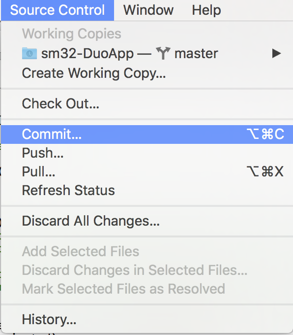

# Git (versiebeheer)


## What is Git?

Git is distributed version control.

This Chapter gives first time users a short intro into git.
For a lot more info please look at the very good book
[ProGit ebook](https://git-scm.com/book/en/v2)
which is free to download.


## Create a repository


A repository is a place (typically online) where your code and
all previous versions of it are stored. We will now create a repository at
the so-called *git-lab* environment at FHICT
(only available for FHICT-students;
An alternative would be creating a repository at *GitHub.com*,
which is very similar)
Use a browser to go to
[https://git.fhict.nl](https://git.fhict.nl)
and create a git repository.
Copy the https-url to your clipboard, we need it in a few moments.


In Git you typically have a `repository` on a network somewhere where
all files of your project are stored, including the history of
`commits` to those files.
Furthermore you have a  `local repository` with all source code versions
which you regularly `synchronize` (using `push` and `pull`) with
the remote repository on a server.
Other people in your team sync with the same remote repository.

## Clone the repository

Next step is creating a so-called `clone` locally on your laptop.
This will be your workspace where you can develop.
By keeping it up to date with the server
(`pushing` your changes to the server
and `pulling` the changes of other developers from the server)
you can work together with other developers.

You can choose between several *tools* to do the `pulling`
and `pushing`,
some created to be easy to use and some more advanced.
Here the *command line* is used: the advantages being that **all**
`git`-functionality is available from the command line.
The syntax shown here is that of a Unix-command line (terminal or bash),
which is the same for every Unix, Linux or Mac user.
If you use have MS-Windows you could install *cygwin*
or adjust the commands a little.

Start a *terminal* or *bash* shell.
Go to the `directory` (*folder*) where you want you workspace to be.
How?
Suppose you want to create a directory (`mkdir` means *make dir*)
*myProject* in your *Documents* `directory`
you type the commands:
```
cd Documents
mkdir myProject
cd myProject
```

`cd` is short for *Change Dir*.
Most of the time you don't have to type whole names like *Documents*:
just type *Doc* and
press the *tab* key and probably the *shell* will complete the name.

In the `terminal` *clone* the git-repository from the server
to your local directory by typing:
```
git clone <pasteYourGitUrlHere>
```
After that (you will be asked for your *username*/*password*)
you now have a local copy (*clone*) of the entire history of this repository
(for a just created project this is still empty of course).
To go inside the local *repository-directory*,
which after a *clone* contains the *latest* version of the files,
use
```
cd <dirname>
```
Typing `git status` tells you that (at this moment)
there’s nothing to commit (which means you don't have made local changes
to the repository).

These are only the basics of *git*.
In my experience most students use it to `commit` and `push` their
changes right from their `IDE`. Most *IDEs* and *editors* nowadays
have built-in `git`-functionality.
Say for example you use Xcode: see xcode-menu ‘Source Control’:
when you succeeded with the above doing the same from xcode
should be a piece of cake! Good luck!
For more info about `git` please look at the very good book
[https://git-scm.com/book/en/v2](https://git-scm.com/book/en/v2)
which is free to download.




## Bronnen

+ [FHICT-git-server https://git.fhict.nl/](https://git.fhict.nl/)
